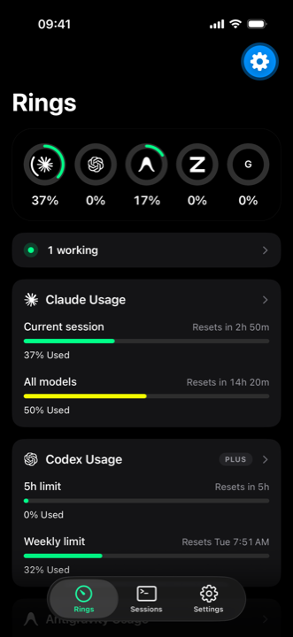
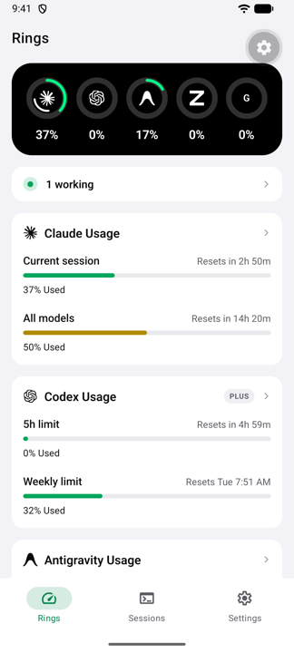

# Codenotch Mobile

Your coding assistant's usage limits — Claude, Codex, GLM and friends — read off
your Mac and shown on your phone. Nothing leaves your local network.

```
┌──────────────────────────┐                              ┌────────────────────────┐
│  Mac                     │   http://192.168.1.20:8788   │  Phone                 │
│  Codenotch (Phone Link)  │ ◀───────────────────────────▶│  Expo / React Native   │
│  reads provider usage    │   HMAC-signed, LAN only      │  rings · sessions      │
└──────────────────────────┘                              └────────────────────────┘
```

The Mac does all the reading. The phone is a viewer: it receives percentages,
reset times and session states — never an API key or token.

<p align="center">
  
  &nbsp;&nbsp;
  
</p>

<p align="center"><sub>The Rings screen — iOS (dark) and Android (light). One codebase, each platform's own look.</sub></p>

## What you get

- **Rings** — one ring per provider, showing how much of the current window is
  spent and when it resets. Tap through for the full window breakdown.
- **Sessions** — every live agent session the Mac knows about, and which one is
  waiting on you (a permission prompt, a question).
- **Settings** — which Mac you're paired with, its address, reading fidelity,
  and the controls to re-pair or disconnect.

Readings refresh every 60 seconds while the app is open, and pull-to-refresh
asks the Mac to re-read every provider on demand.

## Requirements

- Node 20 or newer
- **Codenotch for Mac** with Phone Link (protocol v3) — see
  [vinzdg/codenotch](https://github.com/vinzdg/codenotch) — or the standalone
  Python agent (protocol v3)
- Phone and Mac on the **same local network**
- To build natively: Xcode (iOS) or Android Studio (Android). Expo Go works too.

## Quick start

```sh
npm install
npm start          # then scan the Metro QR with Expo Go
```

Or build and run natively:

```sh
npm run ios        # expo run:ios
npm run android    # expo run:android
```

## Pairing

On the Mac, open Codenotch's Phone Link window to show a QR code. Then, in the
app:

1. **Scan QR Code** — point the camera at the Mac's screen, or
2. **Paste** — copy the link on the Mac ("Copy Link") and paste it in the app.

A pairing code is good for **5 minutes and one pairing**. It rotates as soon as
you pair, so an old screenshot of the QR is worthless.

The app also accepts a pairing link pasted with surrounding text (from Messages,
say) and the `exp+codenotch://` form Expo Go rewrites. The Python agent prints
`codenotch://pair?v=2&h=<hosts>&p=<port>&c=<32 hex code>&n=<name>`, and the
secret is derived on both sides rather than transmitted.

## How the connection works

The Mac runs a small HTTP server on port 8788, bound to its private network
interfaces. The QR encodes its private IPv4 addresses plus `<name>.local`, so
the phone tries each in turn and keeps the one that answers. If the Mac's IP
later changes, the phone falls back to the other addresses on its own.

Pairing derives a per-device secret on both sides from the one-time code, which
derives separate signing (`K_sig`) and encryption (`K_enc`) keys. That secret is
**never transmitted**. Request and response bodies are encrypted with AES-256-GCM.
Every later request carries:

```
X-CN-Timestamp  unix seconds
X-CN-Nonce      16 random bytes, hex-encoded (32 chars)
X-CN-Signature  hex(HMAC-SHA256(K_sig, ts.nonce.METHOD.uri.sha256(envelope)))
X-CN-Device     this phone's id
```

The full contract, including test vectors both sides assert, is in
[PHONE-LINK-V3.md](PHONE-LINK-V3.md).

## Security

- **LAN only.** The Mac refuses any request whose source IP isn't private
  (`10.x`, `172.16–31.x`, `192.168.x`, `169.254.x`, IPv6 ULA/link-local),
  before authentication.
- **No secret on the wire.** Both sides derive the device secret from the
  pairing code; a passive sniffer sees signatures only.
- **No replays.** Timestamps must be within ±120 s and each nonce is single-use
  for 5 minutes.
- **Stored in the keychain.** The connection config lives in `expo-secure-store`,
  not plain AsyncStorage.
- **Revocable.** Remove the phone on the Mac and its next request gets
  `401 unknown-device`; the app then shows a re-pair prompt.

## Project layout

```
src/
  app/            expo-router screens — (tabs)/(rings), sessions, settings, pair, scan
  components/     rings, provider cards, session rows, glyphs, shared primitives
  lib/            api client, pairing, signing, storage, formatting
  state/          connection context and TanStack Query snapshot cache
  theme.ts        design tokens
phone-link-v3-vectors.json   the protocol's test vectors, shared verbatim with
                             the Mac app and the Python agent
```

## Development

```sh
npx tsc --noEmit                          # type check
bun test src/lib/phone-link-v3.test.mjs   # protocol test vectors
```

`src/lib/phone-link-v3.test.mjs` checks crypto derivation, envelopes, and signatures
against `phone-link-v3-vectors.json`. The Mac and Python implementations assert the
same vectors, so if the suites pass, the implementations agree.

## Troubleshooting

**"Couldn't reach your Mac"** — almost always a network problem, not a pairing
problem:

- Phone and Mac must be on the same network. Guest Wi-Fi and networks with
  client isolation block device-to-device traffic even when the name matches.
- Turn off any VPN on the phone; it routes requests away from the LAN.
- Wake the Mac and make sure Codenotch is running.
- On iOS, grant the local network permission when prompted.

**"The phone's clock is off from the Mac's"** — the signature window is ±120 s.
Turn on automatic time on both devices.

**"This Mac only answers the local network"** — the request arrived from a
non-private address, which usually means a VPN or a relayed connection.

## License

MIT. See [LICENSE](LICENSE).
